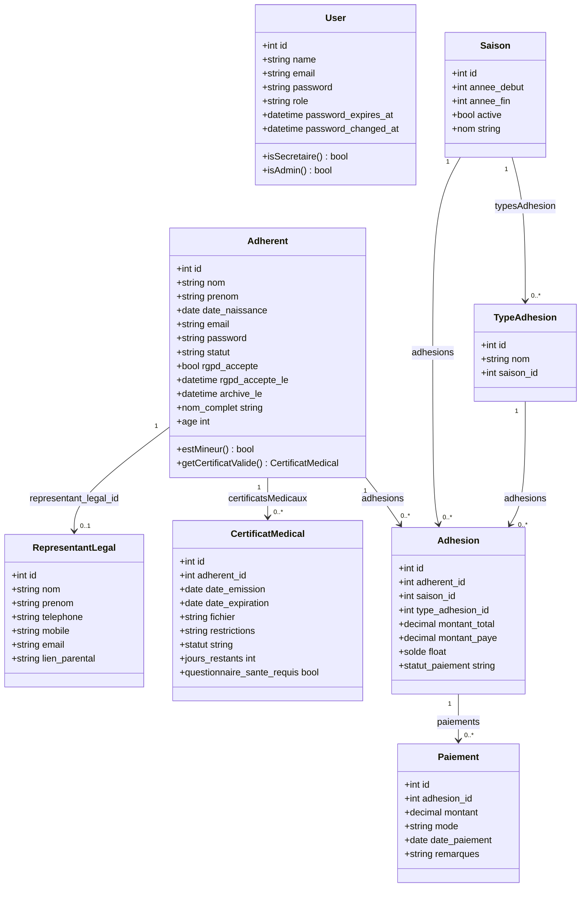
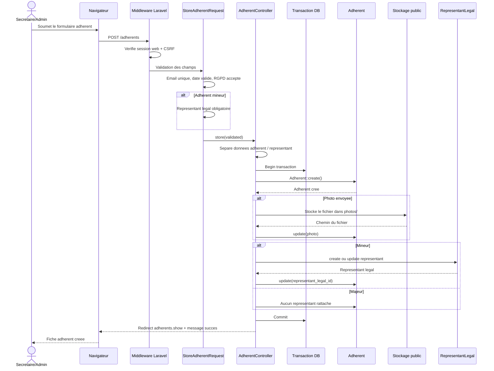

<div align="center">

<svg width="100%" height="180" viewBox="0 0 1200 180" xmlns="http://www.w3.org/2000/svg" role="img" aria-label="Lyon Palme Inscription">
  <defs>
    <linearGradient id="lp" x1="0" y1="0" x2="1" y2="1">
      <stop offset="0%" stop-color="#3F3466"/>
      <stop offset="50%" stop-color="#5B4B8A"/>
      <stop offset="100%" stop-color="#5DD9D2"/>
    </linearGradient>
  </defs>
  <rect x="0" y="0" width="1200" height="180" rx="20" fill="url(#lp)"/>
  <text x="60" y="92" font-size="56" font-family="Verdana, sans-serif" font-weight="700" fill="white">Lyon Palme Inscription</text>
  <text x="62" y="132" font-size="24" font-family="Verdana, sans-serif" fill="rgba(255,255,255,0.9)">Gestion des adherents, certificats medicaux et cotisations</text>
</svg>

</div>

# Lyon Palme Inscription

Application Laravel developpee dans le cadre du BTS SIO SLAM 2026 pour digitaliser le suivi administratif du club Lyon Palme.

Le projet remplace un suivi manuel par une interface web permettant a la secretaire ou a l'administrateur de gerer les adherents, les certificats medicaux, les adhesions, les cotisations et les paiements. Un espace adherent existe aussi pour consulter les informations principales liees au dossier.


## Objectif

Le club doit suivre des dossiers adherents qui changent souvent : nouveaux inscrits, mineurs avec representant legal, certificats expirants, cotisations partielles, paiements multiples et archives. L'application centralise ces informations pour reduire les erreurs de saisie et faciliter les controles de saison.

## Perimetre livre

| Domaine | Fonctionnalites |
|---|---|
| Authentification interne | Connexion secretaire/admin, deconnexion, limitation des tentatives, changement de mot de passe |
| Espace adherents | Creation, consultation, modification, recherche, filtres, archivage et reactivation |
| Mineurs | Detection de l'age et rattachement d'un representant legal |
| RGPD | Consentement obligatoire a la creation, date et adresse IP conservees |
| Certificats medicaux | Liste filtree par statut, calcul des jours restants, telechargement de fichier, export Excel |
| Cotisations | Liste par saison, type d'adhesion et statut de paiement, export Excel |
| Paiements | Enregistrement d'un paiement, controle du solde restant, mise a jour du montant paye |
| Espace adherent | Connexion d'un adherent actif et consultation de son tableau de bord |
| Securite HTTP | CSP, HSTS HTTPS, headers de securite, cache prive, CSRF sans cookie XSRF expose |

## Hors perimetre

- Paiement en ligne reel avec Stripe, HelloAsso ou banque.
- Planning des entrainements, sorties et competitions.
- Messagerie interne et notifications automatiques.
- Annuaire public ou trombinoscope.
- Gestion avancee de roles via package externe.
- Chiffrement metier AES-256 des champs adherents.

## Diagramme de cas d'utilisation

```mermaid
graph TD
    VIS([Visiteur])
    SEC([Secretaire / Admin])
    ADH([Adherent actif])

    VIS --> UC0[Choisir son espace]
    VIS --> UC1[Consulter la page de connexion interne]
    VIS --> UC2[Consulter la page de connexion adherent]

    SEC --> UC3[Se connecter a l'espace interne]
    SEC --> UC4[Consulter le tableau de bord]
    SEC --> UC5[Changer son mot de passe]
    SEC --> UC6[Creer un adherent]
    SEC --> UC7[Modifier un adherent]
    SEC --> UC8[Archiver ou reactiver un adherent]
    SEC --> UC9[Consulter les fiches adherents]
    SEC --> UC10[Filtrer les certificats medicaux]
    SEC --> UC11[Telecharger un certificat]
    SEC --> UC12[Exporter les certificats]
    SEC --> UC13[Suivre les cotisations]
    SEC --> UC14[Enregistrer un paiement]
    SEC --> UC15[Exporter les cotisations]
    SEC --> UC16[Se deconnecter]

    ADH --> UC17[Se connecter a l'espace adherent]
    ADH --> UC18[Consulter son tableau de bord]
    ADH --> UC19[Voir son certificat medical]
    ADH --> UC20[Voir sa cotisation active]
    ADH --> UC21[Voir ses adhesions recentes]
    ADH --> UC22[Se deconnecter]
```



## Diagramme de classes



## Diagramme de sequence - creation d'un adherent



## Architecture du projet

```text
LyonPalmInscription/
+-- app/
|   +-- Exports/                  # Exports Excel certificats et cotisations
|   +-- Http/
|   |   +-- Controllers/          # Flux metier et authentification
|   |   +-- Middleware/           # Headers de securite et CSRF personnalise
|   |   +-- Requests/             # Validation des formulaires
|   +-- Models/                   # Modeles Eloquent du domaine club
|   +-- Providers/
|   +-- Support/
+-- bootstrap/
|   +-- app.php                   # Registration routes, middleware et healthcheck
+-- config/
|   +-- auth.php                  # Guards web et adherent
|   +-- security.php              # CSP, HSTS, cache prive, rate limiting
+-- database/
|   +-- factories/
|   +-- migrations/
|   +-- seeders/
+-- docs/
|   +-- DEPLOYMENT.md             # Guide VPS Nginx + PHP-FPM
+-- public/
|   +-- logo.svg
+-- resources/
|   +-- css/
|   +-- js/
|   +-- views/                    # Layouts, dashboard, adherents, cotisations
+-- routes/
|   +-- web.php                   # Routes publiques, internes et espace adherent
+-- tests/
    +-- Feature/
    +-- Unit/
```

## Stack technique

| Couche | Technologie |
|---|---|
| Backend | Laravel 13, PHP 8.3 |
| Frontend | Blade, Tailwind CSS 4, Alpine.js, Vite 8 |
| Authentification | Guards Laravel `web` et `adherent` |
| Base locale | SQLite |
| Base production | MySQL/MariaDB possible via `.env` |
| Exports | maatwebsite/excel |
| Tests | PHPUnit 12 |
| Qualite code | Laravel Pint |

## Prerequis

- PHP 8.3 ou superieur
- Composer
- Node.js et npm
- SQLite pour le developpement local
- MySQL ou MariaDB pour un deploiement VPS, si souhaite

## Installation locale

```bash
composer install
npm install
cp .env.example .env
php artisan key:generate
touch database/database.sqlite
php artisan migrate:fresh --seed
php artisan storage:link
```

Lancer ensuite le serveur Laravel et Vite dans deux terminaux :

```bash
php artisan serve
npm run dev
```

Une commande Composer existe aussi pour lancer l'environnement de developpement complet :

```bash
composer dev
```

## Configuration `.env` minimale

```dotenv
APP_NAME="Lyon Palme"
APP_ENV=local
APP_DEBUG=true
APP_URL=http://localhost:8000

DB_CONNECTION=sqlite

SESSION_DRIVER=database
CACHE_STORE=database
QUEUE_CONNECTION=database

LOGIN_MAX_ATTEMPTS=5
LOGIN_DECAY_SECONDS=60
```

## Donnees de demo

Les seeders creent :

- une saison active `2025-2026`
- une saison ancienne `2024-2025`
- les types d'adhesion `Adulte`, `Junior`, `Etudiant`, `Enfant`
- 50 adherents de demonstration
- des certificats medicaux valides, expirants et expires
- des adhesions avec paiements complets, partiels ou absents

Comptes disponibles apres `php artisan migrate:fresh --seed` :

| Profil | Email | Mot de passe |
|---|---|---|
| Secretaire | `secretaire@lyonpalme.com` | `SecretLyon2026!` |
| Admin | `admin@lyonpalme.com` | `AdminLyon2026!` |
| Adherent | `adherent01@lyonpalme.test` | `AdherentLyon2026!` |

## Routes principales

| Route | Usage |
|---|---|
| `/` | Page d'accueil avec choix d'espace |
| `/login` | Connexion secretaire/admin |
| `/dashboard` | Tableau de bord interne |
| `/adherents` | Gestion des adherents |
| `/certificats` | Suivi des certificats medicaux |
| `/adhesions` | Suivi des cotisations |
| `/espace-adherent/login` | Connexion adherent |
| `/espace-adherent` | Tableau de bord adherent |
| `/robots.txt` | Metadonnees publiques |
| `/sitemap.xml` | Sitemap public |

## Tests

```bash
composer test
```

Commandes utiles :

```bash
php artisan test --filter=SmokeTest
php artisan test --filter=SecurityHeadersTest
php artisan test --filter=AuthenticationSecurityTest
```

La suite couvre notamment :

- affichage des pages principales
- creation d'un adherent
- connexion interne et adherent
- ajout d'un paiement
- protection CSRF
- rate limiting de connexion
- headers de securite
- absence de cookie XSRF expose

## Securite

- Mots de passe haches via les casts Laravel.
- Deux guards separes : `web` pour les utilisateurs internes, `adherent` pour l'espace adherent.
- Limitation des tentatives de connexion configurable via `LOGIN_MAX_ATTEMPTS` et `LOGIN_DECAY_SECONDS`.
- Consentement RGPD trace sur l'adherent : booleen, date et IP.
- Archivage logique via `statut = archive` et `archive_le`.
- Middleware global `SecurityHeaders` pour CSP, `X-Frame-Options`, `nosniff`, COOP/CORP/COEP, Permissions Policy et HSTS HTTPS.
- Cache prive force sur les pages applicatives.
- Redirections sans corps de reponse pour eviter d'exposer des donnees sensibles apres erreur d'authentification.

## Deploiement

Le projet est pret pour un deploiement VPS sous Nginx + PHP-FPM, soit a la racine d'un domaine, soit sous le chemin `/LyonPalme`.

Guide complet : [docs/DEPLOYMENT.md](docs/DEPLOYMENT.md)

Commandes de production typiques :

```bash
composer install --no-dev --optimize-autoloader
npm ci
npm run build
php artisan migrate --force
php artisan db:seed --force
php artisan storage:link
php artisan config:cache
php artisan route:cache
php artisan view:cache
```

## Roadmap

| Statut | Element |
|---|---|
| Livre | Gestion adherents, certificats, cotisations et paiements |
| Livre | Espace adherent simple |
| Livre | Exports Excel |
| Livre | Tests fonctionnels et securite |
| A finaliser | Captures d'ecran finales dans `docs/screenshots/` |
| Hors scope | Paiement en ligne, planning, trombinoscope, annuaire public |

## Auteur

Cherif Hammani - BTS SIO SLAM 2026<br>
Portfolio : [www.cherifhammani.fr](https://www.cherifhammani.fr)
